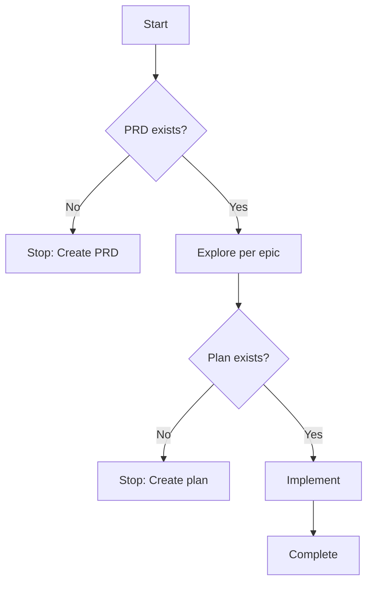
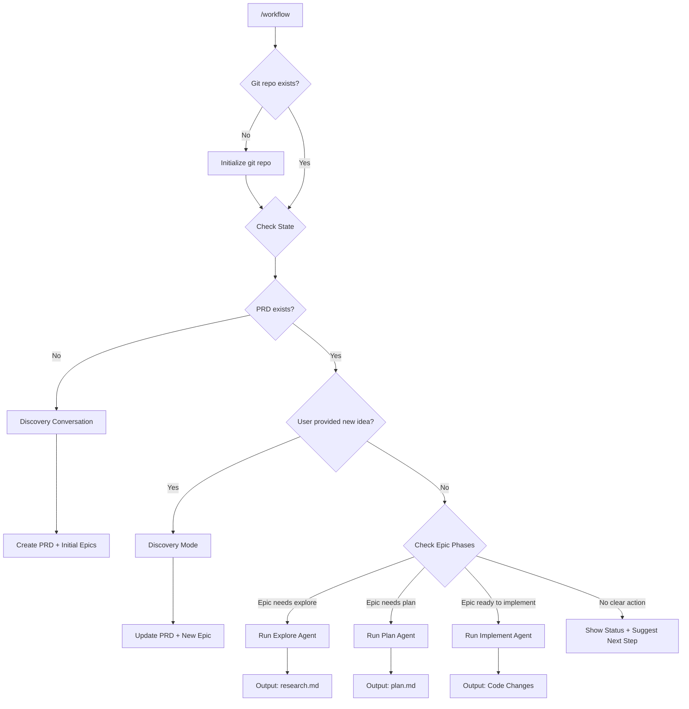
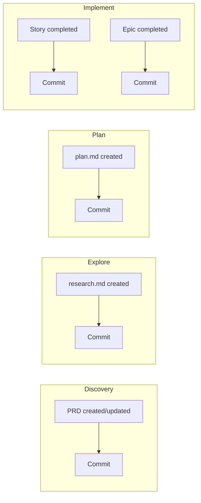
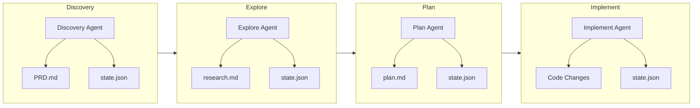
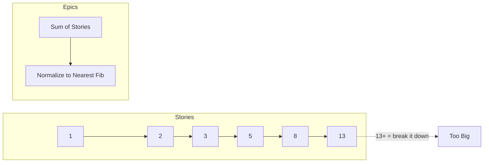

# Claude Code Plugin: AGILE Workflow Vision

## Core Philosophy

AGILE methodology and LLM context limitations share the same solution: **break work into small, focused chunks**.

- LLM performance degrades at ~40% context, seriously at ~60%, breaks at ~80%
- AGILE breaks work into epics → stories for the same reason humans can't hold large projects in their heads
- This plugin enforces a workflow that keeps context minimal and work well-scoped

## Workflow



### Gates (Hard Rules)

| Gate | Prevents |
|------|----------|
| **No PRD → No Explore** | Aimless research without direction |
| **No Plan → No Implement** | Coding without thinking |

### PRD Requirements

- PRD is AI-maintained but MUST exist before any work
- Can be as minimal as one requirement/epic
- Can be bootstrapped from a user's "vision" - Claude infers initial epic
- Living document that grows with the project

## The `/workflow` Command

One command to rule them all. Context-aware routing based on current state.



### Usage Examples

| Command | Context | Result |
|---------|---------|--------|
| `/workflow` | No PRD exists | Start discovery conversation, create PRD + initial epics |
| `/workflow I want to add multiplayer` | PRD exists | Discovery mode, update PRD with new epic |
| `/workflow explore user-auth` | Epic exists | Run exploration, generate research.md |
| `/workflow` | Epic has research, no plan | Auto-continue to planning phase |
| `/workflow` | Epic has plan | Auto-continue to implementation |
| `/workflow` | Nothing pending | Show status, suggest next steps |

### Design Principles

- **Single entry point**: Users don't need to remember multiple commands
- **Context-aware**: The command figures out what to do based on state
- **Discovery-driven**: Epics are created through conversation, not commands
- **Smart routing**: Automatically progresses through phases when ready
- **Git-first**: Initializes git repo on first invocation if none exists - commit history is part of project state

### Commit Strategy

Git commits happen automatically at key workflow points:



| Trigger | Commit Message Pattern |
|---------|------------------------|
| PRD created | `docs(prd): initialize PRD for [project]` |
| PRD updated (new epic) | `docs(prd): add [epic-slug] epic` |
| Exploration complete | `docs(explore): add research for [epic-slug]` |
| Plan complete | `docs(plan): add implementation plan for [epic-slug]` |
| Story complete | `feat([epic-slug]): [story-slug] - [story name]` |
| Epic complete | `feat([epic-slug]): complete epic - [epic name]` |

This provides:
- **Audit trail**: Every decision and change is tracked
- **Rollback points**: Can revert to any phase
- **Progress visibility**: `git log` shows project evolution
- **No extra tooling**: Uses what developers already have

## Agents

Three phase-specific agents execute the actual work:



| Agent | Input | Output | Purpose |
|-------|-------|--------|---------|
| **Discovery** | User's vision/idea | PRD.md, state.json | Extract requirements, define epics through conversation |
| **Explore** | Epic + codebase | research.md | Survey codebase, document what exists with file:line refs |
| **Plan** | Research + requirements | plan.md | Design implementation approach, break into stories |
| **Implement** | Plan | Code changes | Execute stories, update state |

## Artifacts

All workflow artifacts live in `.claude/workflow/` to keep project root clean.

```
your-project/
├── src/
├── package.json
└── .claude/
    └── workflow/
        ├── PRD.md
        ├── state.json
        └── epics/
            └── [epic-slug]/
                ├── research.md
                └── plan.md
```

| Artifact | Format | Consumer | Purpose |
|----------|--------|----------|---------|
| `state.json` | JSON | LLM | Parse, query, update programmatically |
| `PRD.md` | Markdown | Human | Read, review, approve |
| `epics/[slug]/research.md` | Markdown | Human + LLM | Exploration output |
| `epics/[slug]/plan.md` | Markdown | Human + LLM | Implementation approach |

## State File Structure

```json
{
  "project": "project-name",
  "epics": {
    "epic-slug": {
      "name": "Epic Name",
      "description": "This epic implements X, enabling Y",
      "ac": [
        "Acceptance criterion 1",
        "Acceptance criterion 2"
      ],
      "effort": 13,
      "status": "in_progress",
      "phase": "explore | plan | implement | complete",
      "stories": {
        "story-slug": {
          "name": "Story Name",
          "description": "As a [user], I want [goal], so that [benefit]",
          "ac": [
            "Acceptance criterion 1",
            "Acceptance criterion 2"
          ],
          "effort": 5,
          "status": "pending | in_progress | completed",
          "blockers": ["other-story-slug"]
        }
      }
    }
  }
}
```

### Effort Points



- **Stories**: Fibonacci (1, 2, 3, 5, 8, 13)
- **Epics**: Sum of story points, normalized to nearest Fibonacci
- **Signal**: 13+ means break it down further

### Identifiers

- Use slugs (e.g., `user-auth`, `oauth-setup`)
- Self-documenting, grep-able, stable

## Document Formats

### PRD.md

```markdown
# PRD: [Project Name]

## Vision
[One paragraph - what is this project and why does it exist]

## Requirements
- [REQ-1] [Requirement description]
- [REQ-2] [Requirement description]

## Epics

### Epic: [epic-slug]
- **Description**: This epic implements X, enabling Y
- **Requirement**: REQ-1
- **Status**: explore | plan | implement | complete
- **Effort**: [normalized fib]
```

### Research Doc: `epics/[epic-slug]/research.md`

```markdown
# Research: [epic-slug]

## Summary
[2-3 sentences - what exists relevant to this epic]

## Relevant Files

### [category-name]
| File | Lines | Purpose |
|------|-------|---------|
| `src/auth/middleware.ts` | 1-145 | Session handling |

## Patterns Observed
- [Pattern 1]: [file:line] - [description]

## Dependencies
- [dependency]: [version] - [what it's used for]

## Constraints
- [Constraint discovered during exploration]
```

### Plan Doc: `epics/[epic-slug]/plan.md`

```markdown
# Plan: [epic-slug]

## Approach
[1-2 paragraphs - high level technical approach]

## Stories

### Story: [story-slug]
**Description**: As a [user], I want [goal], so that [benefit]
**Effort**: [fib]

#### Acceptance Criteria
- [ ] [Criterion 1]
- [ ] [Criterion 2]

#### Implementation
1. [Step]: `file/path.ts` - [what to do]
2. [Step]: `file/path.ts` - [what to do]

#### Blockers
- [blocker-slug] (if any)

---

## File Change Summary
| File | Action | Stories |
|------|--------|---------|
| `src/auth/oauth.ts` | modify | oauth-setup |

## Order of Operations
1. [story-slug-1] - no dependencies
2. [story-slug-2] - depends on 1
```
