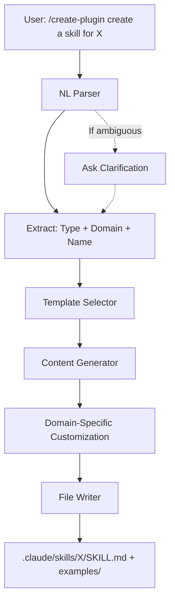

# Design: Plugin Builder

## Architecture Overview

The plugin builder is a Claude Code plugin that scaffolds individual components (skills, agents, commands, hooks) in the current project's `.claude/` directory through natural language commands.



**Key Flow:**
1. User provides NL description via `/create-plugin {description}`
2. Parser extracts: component type, domain/purpose, name
3. Template selector picks base template for component type
4. Content generator creates domain-specific examples
5. File writer creates component in `.claude/{type}/{name}/`

## Components

### 1. Plugin Structure

```
plugins/plugin-builder/
├── .claude-plugin/
│   └── plugin.json           # Plugin metadata
├── commands/
│   └── create-plugin.md      # Main command: /plugin-builder:create-plugin
├── skills/
│   └── generator/
│       └── SKILL.md          # NL parsing and generation skill
└── templates/
    ├── skill/
    │   ├── base.md           # Base skill template
    │   └── examples/
    │       ├── simple.md     # Simple approach template
    │       ├── advanced.md   # Advanced approach template
    │       └── production.md # Production-ready template
    ├── agent/
    │   └── base.md           # Base agent template
    ├── command/
    │   └── base.md           # Base command template
    └── hook/
        ├── hooks.json        # Base hooks configuration
        └── example-hook.sh   # Example hook script
```

### 2. Command Layer (`commands/create-plugin.md`)

**Responsibility**: Entry point for user invocation

**Behavior**:
- Invokes the `plugin-builder:generator` skill
- Passes full NL description to skill
- Minimal logic - delegates to skill

**Example invocation**:
```
/plugin-builder:create-plugin create a skill for code quality review
```

### 3. Generator Skill (`skills/generator/SKILL.md`)

**Responsibility**: Core logic for parsing, template selection, and generation

**Capabilities**:
1. **NL Parsing**: Extract component type and domain from user input
2. **Validation**: Ensure valid component type, handle ambiguities
3. **Template Selection**: Choose appropriate base template
4. **Domain Customization**: Generate domain-specific content
5. **File Operations**: Create directory structure and files

**Parsing Logic**:
```
Input: "create a skill for code quality review"
→ Type: "skill" (keywords: skill, agent skill)
→ Domain: "code quality review"
→ Name: "code-quality-review" (slugified)

Input: "create an agent for deployment automation"
→ Type: "agent" (keywords: agent, subagent, NOT "agent skill")
→ Domain: "deployment automation"
→ Name: "deployment-automation"

Input: "create a command to run tests"
→ Type: "command" (keywords: command, slash command)
→ Domain: "run tests"
→ Name: "run-tests"
```

### 4. Template System

**Responsibility**: Provide base structures for each component type

**Template Variables**:
- `{{NAME}}` - Component name (e.g., "code-quality-review")
- `{{DISPLAY_NAME}}` - Human-readable name (e.g., "Code Quality Review")
- `{{DESCRIPTION}}` - Brief description
- `{{DOMAIN}}` - Domain/purpose (e.g., "code quality review")
- `{{EXAMPLES}}` - Domain-specific examples (generated dynamically)

**Template Types**:

1. **Skill Template** (`templates/skill/base.md`):
   - YAML frontmatter with name/description
   - Structure: When to Use, Process, Key Principles
   - Placeholders for domain-specific content

2. **Agent Template** (`templates/agent/base.md`):
   - YAML frontmatter with agent metadata
   - Role description
   - Instructions and behavior patterns

3. **Command Template** (`templates/command/base.md`):
   - YAML frontmatter
   - Command instructions
   - Usage examples

4. **Hook Template** (`templates/hook/`):
   - hooks.json structure
   - Example hook script with comments

### 5. Domain Customizer

**Responsibility**: Generate domain-specific content using Claude's knowledge

**Approach**:
- Use Claude's understanding of the domain to create relevant examples
- For "code quality review": linting checks, code smell detection, best practices
- For "deployment automation": CI/CD patterns, rollback strategies
- For "test runner": test framework integration, reporting patterns

**Output**: Customized content inserted into template placeholders

### 6. File Writer

**Responsibility**: Write generated content to `.claude/` directory

**Output Structure by Type**:

**Skill**:
```
.claude/skills/{name}/
├── SKILL.md           # Main skill definition
└── examples/
    ├── simple.md      # Approach 1: Basic pattern
    ├── advanced.md    # Approach 2: Intermediate
    └── production.md  # Approach 3: Production-ready
```

**Agent**:
```
.claude/agents/{name}.md
```

**Command**:
```
.claude/commands/{name}.md
```

**Hook**:
```
.claude/hooks/
├── hooks.json         # Updated with new hook
└── {name}.sh          # Hook script
```

## Data Flow

### Happy Path: Creating a Skill

1. **User Input**: `/create-plugin create a skill for code quality review`
2. **Command Invocation**: `create-plugin.md` → invokes `generator` skill
3. **Parsing**:
   - Type: "skill"
   - Domain: "code quality review"
   - Name: "code-quality-review"
4. **Template Selection**: `templates/skill/base.md`
5. **Content Generation**:
   - Load base template
   - Generate domain-specific examples for code quality:
     - Simple: Basic linting checklist
     - Advanced: Code smell detection with patterns
     - Production: Full review workflow with best practices
6. **Variable Substitution**:
   - `{{NAME}}` → "code-quality-review"
   - `{{DISPLAY_NAME}}` → "Code Quality Review"
   - `{{DOMAIN}}` → "code quality review"
   - `{{EXAMPLES}}` → (generated content)
7. **File Writing**:
   - Create `.claude/skills/code-quality-review/`
   - Write `SKILL.md`
   - Create `examples/` directory
   - Write `simple.md`, `advanced.md`, `production.md`
8. **Confirmation**: "Created skill 'code-quality-review' in .claude/skills/"

### Error Handling

**Ambiguous Input**:
- Input: "create something for testing"
- Response: Ask clarification - "Did you mean: 1) Skill, 2) Agent, 3) Command?"

**Invalid Type**:
- Input: "create a widget for X"
- Response: "Unknown component type 'widget'. Valid types: skill, agent, command, hook"

**Existing Component**:
- `.claude/skills/code-quality-review/` already exists
- Response: "Skill 'code-quality-review' already exists. Overwrite? (yes/no)"

## Interfaces

### Command → Skill Interface

```markdown
<!-- commands/create-plugin.md -->
Invoke the plugin-builder:generator skill with the following input:
{user's full NL description}
```

### Skill → Template Interface

Skill reads template files and performs variable substitution:

```python
# Pseudocode
template = read_file('templates/skill/base.md')
content = template.replace('{{NAME}}', name)
                  .replace('{{DISPLAY_NAME}}', display_name)
                  .replace('{{DOMAIN}}', domain)
                  .replace('{{EXAMPLES}}', generated_examples)
```

### Skill → File System Interface

Skill uses Write tool to create files:

```python
# Pseudocode
create_directory(f'.claude/skills/{name}/')
write_file(f'.claude/skills/{name}/SKILL.md', main_content)
create_directory(f'.claude/skills/{name}/examples/')
write_file(f'.claude/skills/{name}/examples/simple.md', simple_example)
write_file(f'.claude/skills/{name}/examples/advanced.md', advanced_example)
write_file(f'.claude/skills/{name}/examples/production.md', production_example)
```

## Key Decisions

### 1. Individual Components vs Full Plugins

**Decision**: Generate individual components in `.claude/` directory
**Rationale**:
- Users want ad-hoc project-specific components
- No need for plugin.json overhead
- Simpler, faster, more focused
- Can be promoted to full plugin later if needed

### 2. Template Files vs Programmatic Generation

**Decision**: Use template files with variable substitution
**Rationale**:
- Templates are easy to maintain and update
- Clear separation between structure and logic
- Domain-specific content is generated dynamically
- Best of both approaches

### 3. NL Parsing Approach

**Decision**: Use Claude's understanding to parse NL input
**Rationale**:
- More natural user experience
- Flexible input patterns
- Claude excels at intent extraction
- Can handle variations ("skill", "agent skill", etc.)

### 4. Examples in Subdirectory

**Decision**: Store multiple approaches in `examples/` subdirectory
**Rationale**:
- Keeps main SKILL.md clean and functional
- Easy to add more examples without cluttering
- Clear progression (simple → advanced → production)
- User can reference or copy examples as needed

### 5. Domain-Specific Customization

**Decision**: Generate domain-specific examples using Claude's knowledge
**Rationale**:
- More valuable than generic templates
- Demonstrates best practices for specific domains
- Educational - teaches domain patterns
- Leverages Claude's broad knowledge base
