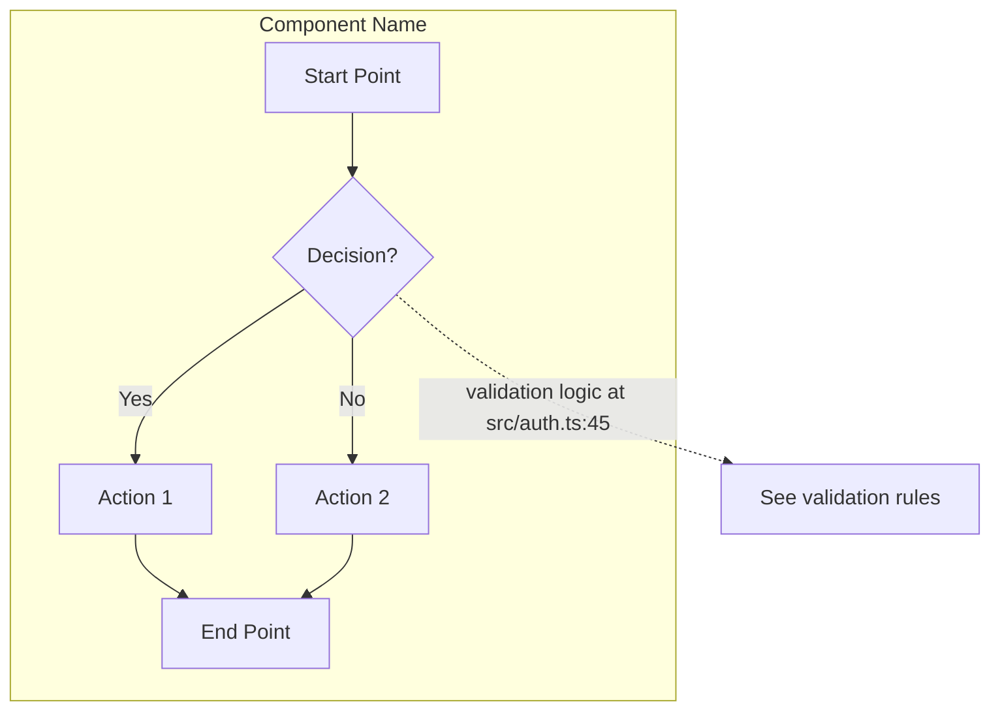
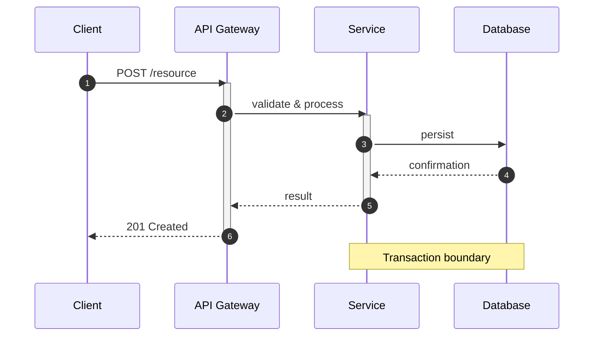
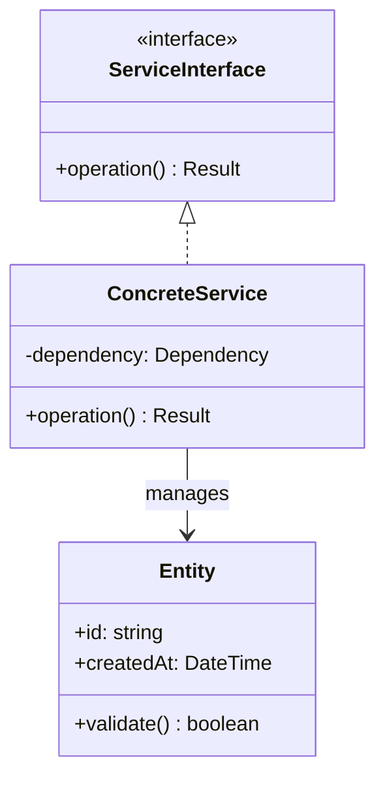
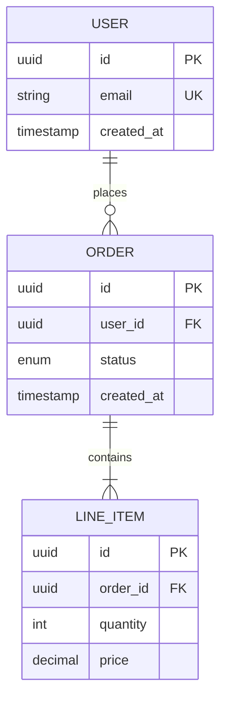
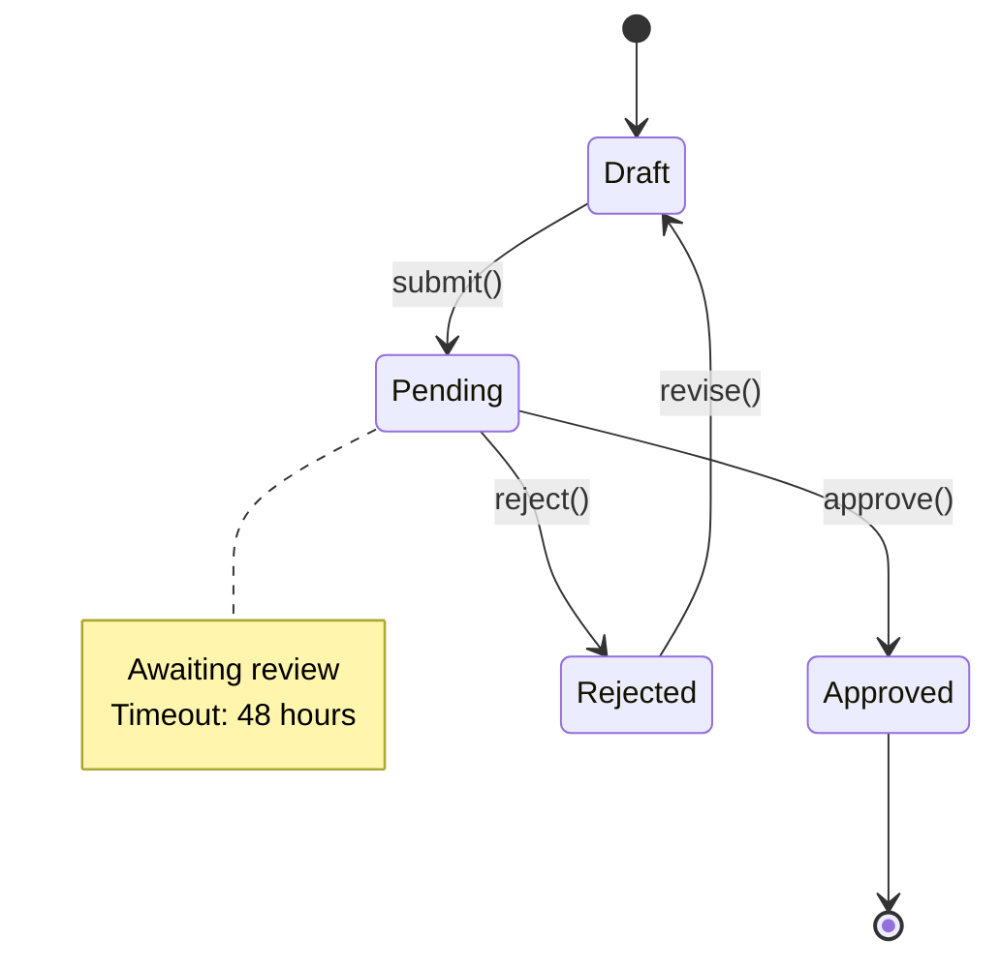
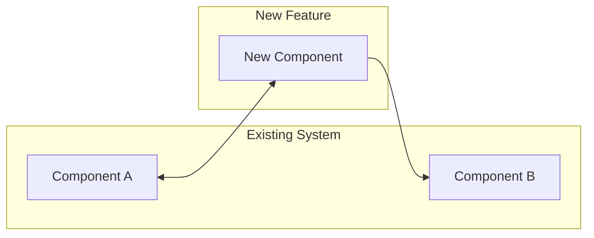
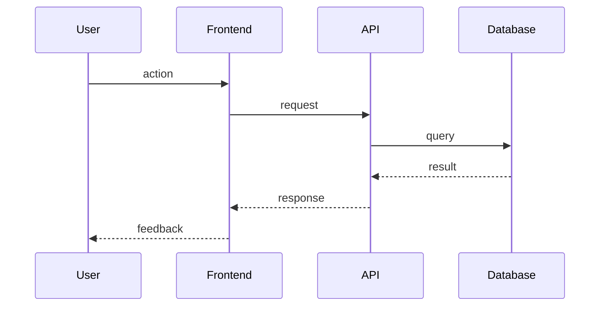

# Design Writer

## Overview

Architect the solution and document it professionally. This skill makes key architectural decisions through Socratic dialogue, synthesizing codebase patterns and research findings, then documents everything with clear Mermaid diagrams.

**Purpose:** Make architectural decisions collaboratively and document them following software architecture best practices.

**Input:**
- Context from `.workflow/NNN-feature-slug/codebase.md`
- Research from `.workflow/NNN-feature-slug/research.md`

**Output:**
- Updated `.workflow/NNN-feature-slug/design.md`
- Updated `.workflow/NNN-feature-slug/contracts.md` (if applicable)

**Announce at start:** "I'm using the design-writer skill to architect and document the solution."

## When to Use

- After `research` skill completes
- User says "design", "architect", "how should we build this"
- When creating or updating design documents
- Invoked directly via `/design-writer`
- Before `plan` skill (design decisions inform implementation steps)

## Core Principles

### 1. Clarity Over Cleverness

Write for the reader who will implement this in 6 months:
- Use concrete examples, not abstract descriptions
- Define all terminology on first use
- Avoid jargon unless necessary (and define it)
- Lead with the "what" before the "why"

### 2. Visual First

Mermaid diagrams should be the primary communication tool:
- Every major concept gets a diagram
- Text explains what the diagram shows
- Diagrams answer "how does this work?" at a glance

### 3. Traceability

Every design element should trace back to:
- Requirements or user needs
- Codebase patterns (with `file:line` references)
- Research findings (with source links)

### 4. Completeness Without Bloat

Include everything needed, nothing more:
- All integration points documented
- All data flows shown
- All error scenarios covered
- No speculative "future" sections

## Mermaid Diagram Best Practices

### When to Use Each Diagram Type

| Diagram Type | Use For | Example |
|--------------|---------|---------|
| **Flowchart** | Decision logic, process flows, state transitions | Authentication flow, error handling paths |
| **Sequence** | Component interactions over time, API calls | Request lifecycle, event propagation |
| **Class** | Data models, type hierarchies, relationships | Domain models, service interfaces |
| **ER** | Database schema, entity relationships | Data layer design |
| **State** | Lifecycle states, state machines | Order status, connection states |
| **C4 Context/Container** | System boundaries, deployment | High-level architecture |

### Diagram Guidelines

1. **Keep diagrams focused** - One concept per diagram
2. **Use meaningful labels** - "UserService validates credentials" not "step 1"
3. **Show the happy path first** - Then add error paths
4. **Include annotations** - Notes for non-obvious details
5. **Limit complexity** - Max 7-10 nodes per diagram; split if larger

### Flowchart Template



### Sequence Diagram Template



### Class Diagram Template



### ER Diagram Template



### State Diagram Template



## Design Document Structure

### Required Sections

Every design document must include:

```markdown
# Design: [Feature Name]

**Date:** YYYY-MM-DD
**Status:** [Draft | Review | Approved | Implemented]
**Authors:** [Names]
**Reviewers:** [Names if applicable]

## References

- **Codebase Analysis:** `.workflow/NNN-slug/codebase.md`
- **Research:** `.workflow/NNN-slug/research.md`
- **Contracts:** `.workflow/NNN-slug/contracts.md` (if applicable)

---

## Executive Summary

[2-3 sentences: What we're building, why, and the key approach]

---

## System Context

[C4 Context diagram or high-level flowchart showing where this fits]



---

## Architecture

### Component Overview

[Class diagram or container diagram showing components]

### [Component 1 Name]

**Purpose:** [Single sentence]

**Location:** `path/to/component/`

**Responsibilities:**
- [Responsibility 1]
- [Responsibility 2]

**Interface:**
```typescript
interface ComponentName {
  method(input: Type): ReturnType;
}
```

**Follows pattern from:** `existing/file.ts:line`

### [Component 2 Name]

[Same structure...]

---

## Data Flow

### Primary Flow: [Flow Name]

[Sequence diagram showing the main use case]



**Step-by-step:**
1. [Step 1 explanation]
2. [Step 2 explanation]

### Error Flow: [Error Scenario]

[Sequence diagram showing error handling]

---

## Data Model

### Entity Relationships

[ER diagram]

### [Entity Name]

```typescript
interface EntityName {
  id: string;           // UUID v4
  field: Type;          // Description
  createdAt: DateTime;  // ISO 8601
}
```

**Validation Rules:**
- `field`: [constraints]

**Indexes:**
- Primary: `id`
- Unique: `[fields]`

---

## State Management

[State diagram if applicable]

### States

| State | Description | Transitions |
|-------|-------------|-------------|
| `state1` | [Description] | `action` → `state2` |
| `state2` | [Description] | `action` → `state3` |

---

## Error Handling

### Error Categories

| Category | HTTP Status | Handling |
|----------|-------------|----------|
| Validation | 400 | Return field-level errors |
| Auth | 401/403 | Redirect to login |
| Not Found | 404 | Show error state |
| Server | 5xx | Retry with backoff |

### Error Flow

[Flowchart showing error handling paths]

---

## Security Considerations

### Authentication
[How authentication works for this feature]

### Authorization
[What permissions are required]

### Data Protection
[How sensitive data is handled]

---

## Testing Strategy

### Unit Tests
- [What to test at unit level]

### Integration Tests
- [What to test at integration level]

### Edge Cases
- [Key edge cases to cover]

---

## Key Decisions

| Decision | Choice | Rationale | Evidence |
|----------|--------|-----------|----------|
| [Decision] | [Choice] | [Why] | `codebase.md` / `research.md` |

---

## Non-Goals

[What we're explicitly NOT doing]

---

## Open Questions

- [ ] [Question that needs resolution]
```

## Writing Process

### Phase 1: Gather Context

1. Read existing design decisions
2. Review `codebase.md` for patterns and constraints
3. Review `research.md` for best practices
4. Identify all components and interactions

### Phase 2: Diagram First

Before writing prose:

1. **Draw the system context** - Where does this fit?
2. **Draw the components** - What are we building?
3. **Draw the primary flow** - How does it work?
4. **Draw error flows** - What can go wrong?
5. **Draw the data model** - What data exists?

### Phase 3: Write Around Diagrams

For each diagram:

1. Add a brief introduction (1-2 sentences)
2. Explain what the diagram shows
3. Add step-by-step breakdown if complex
4. Reference relevant code patterns

### Phase 4: Fill Remaining Sections

Complete all required sections:
- Error handling
- Security considerations
- Testing strategy
- Key decisions
- Non-goals

### Phase 5: Review for Completeness

Checklist:
- [ ] Every component has a diagram
- [ ] Every flow is visualized
- [ ] Every decision is documented with rationale
- [ ] All `file:line` references are accurate
- [ ] All research sources are cited
- [ ] No speculative "future" content
- [ ] All error scenarios covered
- [ ] Security considerations addressed

## Handoff

After writing/updating the design document:

```
I've documented the design in `.workflow/NNN-feature-slug/design.md`.

**Document includes:**
- [Number] architecture diagrams
- [Number] data flow sequences
- [Number] documented decisions

**Key visualizations:**
- System context showing [what]
- [Flow name] sequence diagram
- Data model with [N] entities

The design follows [pattern name] from the existing codebase and incorporates best practices from the research.

What's next?

**A) Run `/plan`** (Recommended)
   Break this into implementation tasks

**B) Review the design document**
   Let's walk through what I documented

**C) Update specific sections**
   There's something to add or change

**D) Other**
   Something else in mind
```

**IMPORTANT:** When user selects option A, invoke the `plan` skill using the Skill tool. Do NOT proceed to implementation or trigger built-in plan mode.

## Anti-Patterns to Avoid

### Documentation Anti-Patterns

- **Wall of text** - Use diagrams, not paragraphs
- **Abstract descriptions** - Use concrete examples
- **Missing context** - Always show where things fit
- **Orphan components** - Every component must connect to something
- **Undocumented decisions** - Every choice needs rationale

### Diagram Anti-Patterns

- **Too complex** - Split diagrams that exceed 7-10 nodes
- **Missing labels** - Every arrow should explain the interaction
- **No annotations** - Add notes for non-obvious details
- **Inconsistent styling** - Use same notation throughout
- **Wrong diagram type** - Match diagram to what you're explaining

### Content Anti-Patterns

- **Future speculation** - Only document what's being built now
- **Redundant prose** - Don't repeat what diagrams show
- **Missing error paths** - Always document failure scenarios
- **Vague security** - Be specific about auth/authz
- **No traceability** - Every element should trace to requirements

## Key Principles

- **Visual first** - Diagrams are primary, text is secondary
- **One concept per diagram** - Keep diagrams focused
- **Concrete examples** - Show, don't just describe
- **Complete coverage** - All flows, all errors, all states
- **Traceability** - Link to codebase and research
- **No speculation** - Document only what's being built
- **Consistent structure** - Follow the template for every design
