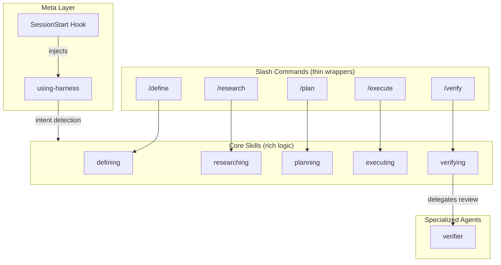
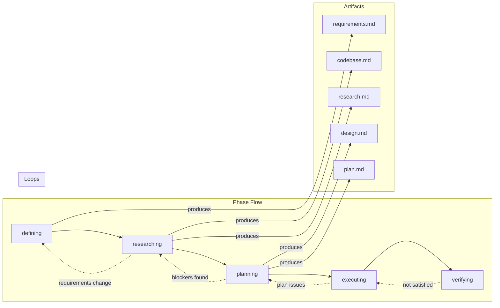
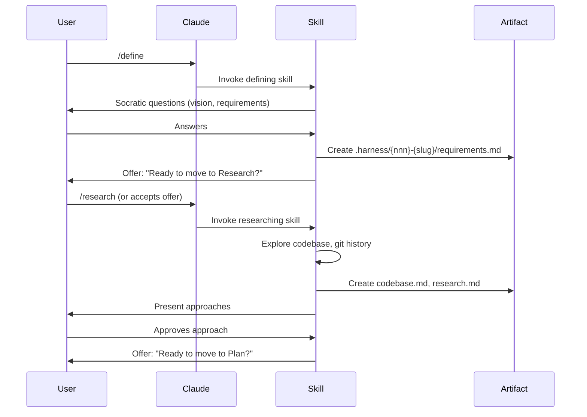

# Design: Harness Workflow Plugin

## Architecture Overview

The harness plugin implements a 5-phase workflow through thin command wrappers that delegate to rich skill definitions. A meta-skill provides intent detection, and a verifier agent handles peer review simulation.



## Component Design

### 1. Commands Layer

Each command is a thin wrapper with `disable-model-invocation: true` to prevent improvisation.

| Command | Invokes Skill | Purpose |
|---------|---------------|---------|
| `/define` | `harness:defining` | Start/return to Define phase |
| `/research` | `harness:researching` | Start/return to Research phase |
| `/plan` | `harness:planning` | Start/return to Plan phase |
| `/execute` | `harness:executing` | Start execution |
| `/verify` | `harness:verifying` | Run verification |

### 2. Skills Layer

Each skill contains the complete logic for its phase, following the Socratic method and producing appropriate artifacts.



#### Skill Responsibilities

**defining** - Establish what needs to be done
- Socratic dialogue: vision → requirements → constraints → success criteria
- Creates task directory: `.harness/{nnn}-{slug}/`
- Produces: `requirements.md`
- Offers transition to Research when complete

**researching** - Informed discovery
- Explores codebase structure and patterns
- Mines git history for context
- Researches external best practices
- Produces: `codebase.md`, `research.md`
- Presents approaches (recommended marked)
- Offers transition to Plan when user approves approach

**planning** - Collaborative design
- Section-by-section Socratic dialogue
- High-level architecture decisions
- Granular implementation steps
- Produces: `design.md`, `plan.md`
- Handles deferrals to `backlog.md`
- Offers transition to Execute when plan approved

**executing** - Implement changes
- TDD by default (document exceptions)
- Follows plan step-by-step
- Updates progress in plan.md
- Incremental commits
- Offers transition to Verify when complete

**verifying** - Rigorous validation
- Runs full test suite
- Validates against requirements.md
- Validates against plan.md
- Delegates to verifier agent for peer review
- Complete only when tests pass AND user satisfied

### 3. Meta-Skill: using-harness

Injected via SessionStart hook. Provides:
- Workflow awareness and intent detection
- Phase transition suggestions
- Lightweight mode recognition
- Spike pattern detection
- Active task context loading

### 4. Verifier Agent

A specialized subagent persona for peer review simulation:
- Reviews code like a colleague before PR merge
- Checks test coverage and quality
- Validates implementation against requirements
- Reports findings back to main conversation

### 5. Hook: SessionStart

Injects workflow context at session start:
- Loads `using-harness` skill content
- Checks for active task in `.harness/`
- Provides continuity across sessions

## Artifact Structure

```
.harness/
├── backlog.md                    # Project-level deferred items
├── 001-implement-workflow/       # This task
│   ├── requirements.md
│   ├── codebase.md
│   ├── research.md
│   ├── design.md                 # This file
│   └── plan.md
└── 002-next-task/               # Future tasks
    └── ...
```

## Data Flow



## Edge Case Handling

| Scenario | Handled By | Behavior |
|----------|------------|----------|
| Trivial task | using-harness | Suggests lightweight mode |
| Unknown territory | using-harness | Suggests spike |
| Requirements change mid-research | researching | Loops back to defining |
| Blocker found in planning | planning | Loops back to researching |
| Execution fails | executing | Stops, assesses, loops back |
| Tests pass but user unsatisfied | verifying | Loops back to executing |
| Scope addition | Any skill | Updates requirements, ripples through |
| Task switch | using-harness | Preserves state in artifacts |

## Key Design Decisions

1. **Commands are thin** - All logic lives in skills for maintainability
2. **Skills are self-contained** - Each skill has complete phase logic
3. **Artifacts are the source of truth** - State persists across sessions
4. **Socratic method enforced** - Skills guide, don't dictate
5. **TDD by default** - But documented exceptions allowed
6. **Human in the loop** - User controls all transitions
