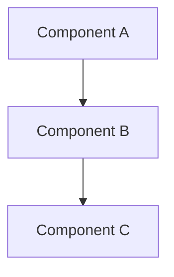

# Design

Transforms a specification into a concrete technical design with architecture decisions, data structures, and implementation approach.

## Prerequisites

- Specification exists (`.harness/NNN-{slug}/spec.md`)
- CLAUDE.md conventions are understood
- Relevant codebase context gathered

## Process

### 1. Read Inputs
- Read the specification
- Read CLAUDE.md for conventions
- Explore relevant existing code patterns

### 2. Assess Complexity

**Simple** (combined design+plan):
- Single file change
- Clear, isolated scope
- < 3 implementation tasks
- No architectural decisions

**Complex** (full design document):
- Multiple files affected
- Architectural decisions needed
- Integration with existing systems
- New patterns being introduced

For simple changes, produce a brief design section and move directly to planning.

### 3. Design Sections

Present each section, asking for confirmation before moving to the next:

#### Architecture Overview
"Here's the high-level architecture I'm proposing: [description]"

Include Mermaid diagram for complex relationships:


#### Data Structures
"These are the data structures we'll need: [description]"

```typescript
interface Example {
  id: string;
  // ...
}
```

#### Key Algorithms/Logic
"Here's how the core logic will work: [description]"

#### Integration Points
"This will integrate with existing code at: [file:line references]"

#### Error Handling
"Errors will be handled by: [approach]"

#### Testing Strategy
"We'll verify correctness through: [approach]"

### 4. Section-by-Section Confirmation

After each major section:
"Does this approach work for you, or would you like to explore alternatives?"

If user has concerns:
- Discuss alternatives
- Adjust design
- Re-confirm

### 5. Final Design Summary

Combine all confirmed sections into complete design document.

## Output

Create `.harness/NNN-{slug}/design.md`:

```markdown
# Design: {Feature Name}

## Overview
{Brief summary of the design approach}

## Architecture

{Architecture description}

### Diagram
```mermaid
{diagram if applicable}
```

## Data Structures

{Data structure definitions with types}

## Implementation Approach

### Core Logic
{How the main functionality works}

### Integration Points
{Where this connects to existing code, with file:line references}

## Error Handling
{Error handling strategy}

## Testing Strategy
{How this will be tested}

## Decisions & Rationale

| Decision | Rationale |
|----------|-----------|
| {decision 1} | {why} |
| {decision 2} | {why} |

## Open Questions
{Any remaining questions to resolve during implementation}
```

## Mermaid Diagrams

Use diagrams to illustrate:
- Component relationships (graph TD/LR)
- Sequence flows (sequenceDiagram)
- State machines (stateDiagram-v2)
- Class relationships (classDiagram)

Only include diagrams when they add clarity. Simple changes don't need diagrams.

## Git

After design is confirmed:
```bash
git add .harness/NNN-{slug}/design.md
git commit -m "docs(NNN): design {feature}"
```

## Principles

- **Minimal viable design**: Don't over-engineer. Design for current requirements.
- **Follow existing patterns**: Check codebase for conventions before introducing new patterns.
- **Explicit tradeoffs**: When making architectural decisions, state the alternatives considered.
- **Verifiable claims**: Reference specific files/lines when discussing integration points.
- **User agency**: User confirms each section. Never proceed without agreement.
