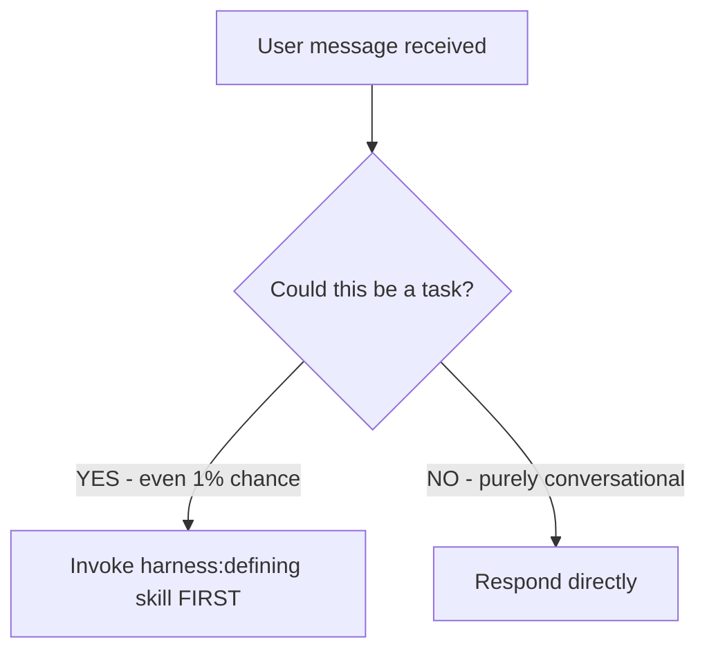

## CRITICAL REQUIREMENT

**ANY task that involves building, adding, fixing, changing, or exploring code MUST go through the harness workflow.**

**IF A HARNESS SKILL APPLIES, YOU DO NOT HAVE A CHOICE. YOU MUST USE IT.**

This is not negotiable. This is not optional. You cannot rationalize your way out of this.

## Intent Detection - CRITICAL

**When you see ANY of these patterns, invoke `harness:defining` IMMEDIATELY:**

| User Says | Your Response |
|-----------|---------------|
| "Let's add X" | → Invoke harness:defining |
| "Take a look at Y" | → Invoke harness:defining |
| "Can you help me with Z" | → Invoke harness:defining |
| "I want to build..." | → Invoke harness:defining |
| "We need to fix..." | → Invoke harness:defining |
| "Let's implement..." | → Invoke harness:defining |
| "Can we add..." | → Invoke harness:defining |
| "I'm thinking about..." | → Invoke harness:defining |
| "What if we..." | → Invoke harness:defining |
| "How would you approach..." | → Invoke harness:defining |
| "Let's explore..." | → Invoke harness:defining |
| "Take a look at adding..." | → Invoke harness:defining |
| "Help me understand..." | → Invoke harness:defining |
| "I need to..." | → Invoke harness:defining |
| "Could you..." (+ any action) | → Invoke harness:defining |
| "Refactor X" | → Invoke harness:defining |
| "Delete/remove X" | → Invoke harness:defining |
| "Update X" | → Invoke harness:defining |
| "Migrate X" | → Invoke harness:defining |
| "Debug X" | → Invoke harness:defining |
| "Optimize X" | → Invoke harness:defining |
| "Write tests for X" | → Invoke harness:defining |
| "Review X" | → Invoke harness:defining |
| "Document X" | → Invoke harness:defining |
| "Create X" | → Invoke harness:defining |
| "Set up X" | → Invoke harness:defining |

**The ONLY time you respond directly (no skill):**
- Pure greetings: "Hello", "Hi", "Good morning"
- Meta questions about the workflow itself: "What is harness?", "How does this work?"
- Explicit requests to skip: "Just do X without the workflow"

**When in doubt → Invoke harness:defining. Let the defining skill decide if it's lightweight.**

# Harness Workflow

**Define → Research → Plan → Execute → Verify**

## The Rule

**Check for harness skills BEFORE ANY RESPONSE.** This includes clarifying questions. Even 1% chance means invoke the skill first.



## Red Flags

These thoughts mean STOP—you're rationalizing:

| Thought | Reality |
|---------|---------|
| "Let me just take a quick look first" | That IS the task. Start with defining. |
| "This is just a simple question" | Questions about code are tasks. Use defining. |
| "I need more context first" | Defining skill gathers context properly. |
| "Let me explore the codebase first" | Research phase does that. Start with defining. |
| "I can check this quickly" | Quick checks become tasks. Use the workflow. |
| "This doesn't need the full workflow" | Use lightweight mode, but START with defining. |
| "I'll just do this one thing first" | Check BEFORE doing anything. |
| "The user just wants a quick answer" | The workflow has lightweight mode for that. |
| "This feels productive" | Undisciplined action wastes time. Workflow prevents this. |

## Skill Priority

When the user presents any task:

1. **ALWAYS start with `harness:defining`** - Even for "simple" things
2. **Defining will route you** - It handles lightweight mode, spikes, etc.
3. **Never skip to later phases** - The workflow exists for a reason

"Let's add X" → harness:defining (will gather requirements)
"Take a look at Y" → harness:defining (may suggest spike or research)
"Fix this bug" → harness:defining (will clarify what's broken)
"Explore this codebase" → harness:defining (will scope the exploration)

## Phase Overview

| Phase | Skill | Purpose | Produces |
|-------|-------|---------|----------|
| **Define** | `harness:defining` | Establish requirements through Socratic dialogue | `requirements.md` |
| **Research** | `harness:researching` | Explore codebase and best practices | `codebase.md`, `research.md` |
| **Plan** | `harness:planning` | Collaborative design with user approval | `design.md`, `plan.md` |
| **Execute** | `harness:executing` | TDD implementation following the plan | Code + tests |
| **Verify** | `harness:verifying` | Rigorous validation before completion | Passing tests + user satisfaction |

## Slash Commands

Users can explicitly invoke phases:
- `/define` - Start or return to Define phase
- `/research` - Start or return to Research phase
- `/plan` - Start or return to Plan phase
- `/execute` - Start execution
- `/verify` - Run verification

## Lightweight Mode

For trivial tasks, the **defining skill** will recognize this and suggest lightweight mode:
- Typo fixes, config tweaks, one-line changes
- Quick verbal define → execute → verify
- Still goes through defining first to make that determination

## Spikes

For exploratory work, the **defining skill** will recognize this and suggest a spike:
- When requirements can't be defined without exploring first
- Creates `.harness/{nnn}-spike-{topic}/`
- Produces `spike-findings.md`

## Active Task Detection

At session start:
1. Check for `.harness/` directories
2. Find the most recent task
3. Read its artifacts to understand current state
4. Offer to continue or start fresh

## Artifact Structure

```
.harness/
├── backlog.md                # Project-level deferred items
├── {nnn}-{slug-name}/        # Task directory
│   ├── requirements.md       # Vision, requirements, constraints
│   ├── codebase.md          # Codebase analysis
│   ├── research.md          # External research
│   ├── design.md            # Architecture
│   └── plan.md              # Implementation steps
└── {nnn}-spike-{topic}/     # Spike directory
    └── spike-findings.md    # Spike learnings
```

## Key Principles

- **Socratic method** - Guide through questions, don't dictate
- **Human in the loop** - User controls all decisions
- **TDD by default** - Write tests first, document exceptions
- **Git as audit trail** - Commits tell the story
- **Artifacts stay current** - Update when understanding changes
- **Don't get stuck** - Loop back when blocked, iterate

## User Instructions

Instructions say WHAT, not HOW. "Add X" or "Fix Y" doesn't mean skip workflows.

The user hired the workflow. Trust it. Start with defining.
