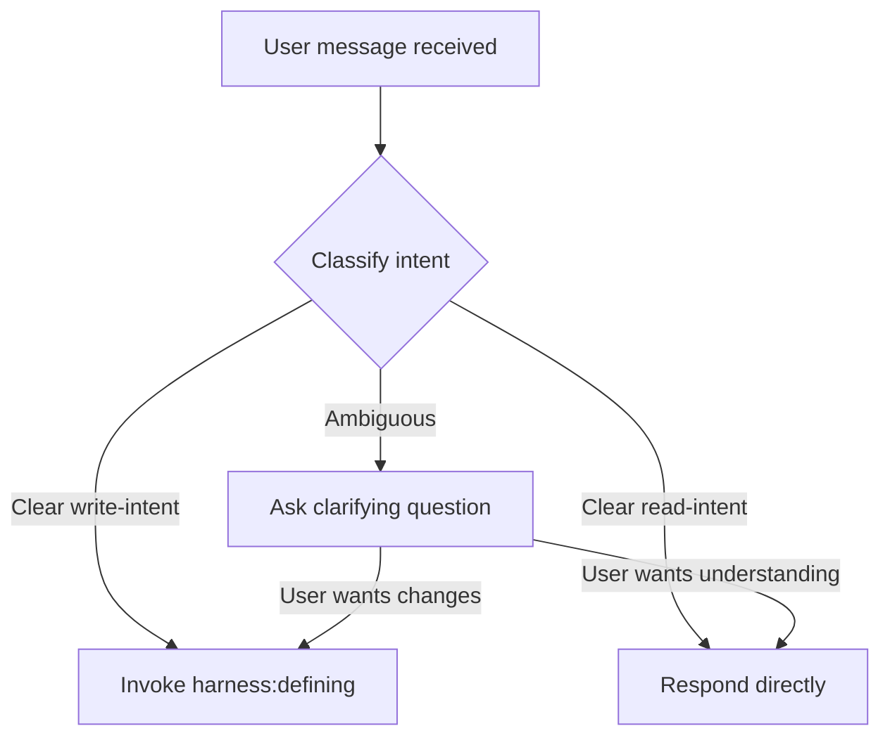

## CRITICAL REQUIREMENT

**Code-changing tasks MUST go through the harness workflow.**

**But not everything is a code-changing task.** Some requests are purely about understanding or analysis. The workflow helps you distinguish:

- **Write-intent**: User wants to build, fix, or change code → Invoke `harness:defining`
- **Read-intent**: User wants to understand or analyze → Respond directly
- **Ambiguous**: Could be either → Ask a clarifying question first

## Intent Detection

### Write-Intent (invoke harness:defining immediately)

These patterns indicate the user wants to make changes:

| Pattern | Action |
|---------|--------|
| "Add X", "Build X", "Create X", "Implement X" | → Invoke harness:defining |
| "Fix X", "Debug X", "Refactor X" | → Invoke harness:defining |
| "Update X", "Change X", "Modify X" | → Invoke harness:defining |
| "Delete X", "Remove X" | → Invoke harness:defining |
| "Migrate X", "Optimize X" | → Invoke harness:defining |
| "Write tests for X", "Set up X" | → Invoke harness:defining |
| "I want to build...", "We need to fix..." | → Invoke harness:defining |
| "Let's implement...", "Can we add..." | → Invoke harness:defining |
| "What should I work on...", "What's next..." | → Invoke harness:defining |

### Read-Intent (respond directly, no workflow)

These patterns indicate the user wants information, not changes:

| Pattern | Action |
|---------|--------|
| "What does X do?" | → Respond directly |
| "How does X work?" | → Respond directly |
| "Why is X designed this way?" | → Respond directly |
| Pure greetings: "Hello", "Hi", "Good morning" | → Respond directly |
| Meta questions: "What is harness?", "How does this workflow work?" | → Respond directly |
| Explicit skip: "Just do X without the workflow" | → Respond directly |

### Ambiguous Intent (ask clarifying question first)

These patterns could go either way—ask before proceeding:

| Pattern | Clarification |
|---------|---------------|
| "Review X" | Could be analysis or finding issues to fix |
| "Take a look at X", "Look at X" | Could be understanding or prep for changes |
| "Check X" | Could be verification or investigation |
| "Help me understand X" | Could be learning or informing upcoming work |
| "Explain X" | Could be education or prep for modification |
| "Explore X" | Could be discovery or scoping changes |
| "Can you help me with X" | Depends entirely on what X is |
| "I'm thinking about X" | Could be brainstorming or planning changes |
| "What if we X" | Could be hypothetical or a proposal |

**Clarification template:**
> "Before I proceed—are you looking to **understand/analyze** this, or do you want to **make changes**?"

After the user responds:
- If they want understanding → Respond directly with analysis
- If they want changes → Invoke `harness:defining`

## The Decision Flow



# Harness Workflow

**Define → Research → Plan → Execute → Verify**

## The Rule

**Classify intent BEFORE responding.** Write-intent gets the workflow. Read-intent gets a direct answer. Ambiguous gets clarification.

## Red Flags

These thoughts mean you should pause and classify properly:

| Thought | Consider |
|---------|----------|
| "Let me just take a quick look first" | Is this exploration (read) or prep for changes (write)? Ask if unclear. |
| "This is just a simple question" | Questions about what/how/why are read-intent. Respond directly. |
| "I need more context first" | If context is for changes, that's the Define phase. If just curiosity, respond. |
| "The user just wants a quick answer" | If it's a question, answer it. If it's a task disguised as a question, use workflow. |
| "This feels like it could go either way" | That's ambiguous. Ask for clarification. |

## Skill Priority

When the user presents a task:

1. **Classify the intent** - Write, read, or ambiguous?
2. **For ambiguous, ask first** - One clarifying question resolves it
3. **Then proceed accordingly** - Workflow for write, direct response for read

Examples:
- "Add a new feature" → Write-intent → harness:defining
- "How does authentication work here?" → Read-intent → Respond directly
- "Take a look at this bug" → Ambiguous → Ask: "Understanding it or fixing it?"

## Phase Overview

| Phase | Skill | Purpose | Produces | Subagent Usage |
|-------|-------|---------|----------|----------------|
| **Define** | `harness:defining` | Establish requirements through Socratic dialogue | `requirements.md` | Main agent dispatches subagent for requirements gathering |
| **Research** | `harness:researching` | Explore codebase and best practices | `codebase.md`, `research.md` | Main agent dispatches subagent for exploration |
| **Plan** | `harness:planning` | Collaborative design with user approval | `design.md`, `plan.md` | Main agent dispatches subagent for design and planning |
| **Execute** | `harness:executing` | TDD implementation following the plan | Code + tests | Main agent dispatches subagent for baseline review, then subagents for each implementation step (parallel when possible) |
| **Verify** | `harness:verifying` | Rigorous validation before completion | Passing tests + user satisfaction | Main agent dispatches verifier subagent for validation |

## Subagent Orchestration Pattern

**Each phase skill uses subagents to keep main context low:**

1. **Main agent** - Reads the skill, understands phase requirements, dispatches subagent
2. **Subagent** - Does the detailed work (gathering requirements, exploring code, designing, implementing, verifying)
3. **Main agent** - Reviews subagent output, coordinates next phase

**Benefits:**
- Main context stays minimal (orchestration only)
- Subagents have focused context for their specific work
- Parallel execution possible (especially during Execute phase)
- Each phase can be deep and thorough without context bloat

## Slash Commands

Users can explicitly invoke phases:
- `/define` - Start or return to Define phase
- `/research` - Start or return to Research phase
- `/plan` - Start or return to Plan phase
- `/execute` - Start execution
- `/verify` - Run verification

## Lightweight Mode

For trivial tasks, the **defining skill** will recognize this and suggest lightweight mode:
- Typo fixes, config tweaks, one-line changes
- Quick verbal define → execute → verify
- Still goes through defining first to make that determination

## Spikes

For exploratory work, the **defining skill** will recognize this and suggest a spike:
- When requirements can't be defined without exploring first
- Creates `.harness/{nnn}-spike-{topic}/`
- Produces `spike-findings.md`

## Active Task Detection

At session start:
1. Check for `.harness/` directories
2. Find the most recent task
3. Read its artifacts to understand current state
4. Offer to continue or start fresh

## Artifact Structure

```
.harness/
├── backlog.md                # Project-level deferred items
├── {nnn}-{slug-name}/        # Task directory
│   ├── requirements.md       # Vision, requirements, constraints
│   ├── codebase.md          # Codebase analysis
│   ├── research.md          # External research
│   ├── design.md            # Architecture
│   └── plan.md              # Implementation steps
└── {nnn}-spike-{topic}/     # Spike directory
    └── spike-findings.md    # Spike learnings
```

## Hook-Based Gates (Enforced)

The workflow is enforced by hooks that BLOCK operations if prerequisites aren't met:

| Gate | Blocks | Unless |
|------|--------|--------|
| **Edit/Write** | Any code modification | `plan.md` has `<!-- APPROVED -->`, OR file is in `.harness/`, OR `.harness/.lightweight` exists |
| **Research** | `harness:researching` | `requirements.md` exists |
| **Plan** | `harness:planning` | `codebase.md` or `research.md` exists |
| **Execute** | `harness:executing` | `plan.md` has `<!-- APPROVED -->` |
| **Verify** | `harness:verifying` | Plan has completed steps |

**These are hard blocks** - you cannot rationalize around them. The system will reject the operation.

## Key Principles

- **Classify first** - Determine intent before acting
- **Ask when unsure** - One clarifying question prevents wrong-path recovery
- **Socratic method** - Guide through questions, don't dictate
- **Human in the loop** - User controls all decisions
- **TDD by default** - Write tests first, document exceptions
- **Git as audit trail** - Commits tell the story
- **Artifacts stay current** - Update when understanding changes
- **Don't get stuck** - Loop back when blocked, iterate

## User Instructions

Instructions say WHAT, not HOW. But "understand X" and "build X" are different intents—classify correctly.
